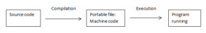
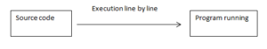

# JavaScript : A tour of the JavaScript Engine🚀⚙️

###
As JavaScript devs, we usually don't have any idea how our JavaScript codes deal with compilers and how can machine actually understand the code that we've written !!?

However,in this blog we'll discuss about basics of the JavaScript Engine and see how it handles our human-friendly JavaScript code and turns it into machine code.


## Journey of Early JS Engine
The first JavaScript engine, codenamed SpiderMonkey, was built for Netscape Navigator and was simply an interpreter that read and executed source code. At the time, and for many years after, Javascript generally consisted of a few functions written into the head of a webpage or a handful of inline events. Interpreting the code as needed was satisfactory, if not fast.

We’ll skip the next 10 tumultuous years, to 2004, when Google introduced a new application; Google Maps. For Javascript and developers everywhere it was a game changer. A very, very slow game changer. Browsers bogged down as the JavaScript engine simply plowed away at all that code. 
So I’d like to provide you with a very brief overview of engines, especially the shiniest toy in the box right now, V8.

```Douglas Crockford, author of JavaScript: The Good Parts, said “JavaScript contains some of the best ideas ever put into a programming language and it contains some of the worst ideas ever put into a programming language.” It was created in just 10 days in 1995, and not standardized by ECMA until almost 3 years later.```

## What is the JS Engine ?
The JavaScript Engine is a program whose responsibility is to execute JavaScript code. All modern browsers come with their own version of the JavaScript Engine but the most popular one is Google’s V8 Engine. Google’s V8 engine powers Google Chrome browsers, as well as, Node.js. Node.js is a JavaScript runtime that is used to build server-side applications outside of the browser.

### What is Compilation in Programming?
During compilation, the entire source code gets converted into machine code all at once. The machine code is written into a portable file that can be executed anywhere – regardless of platform or operating system. There are two steps involved in the code compilation process. In the first step, the machine code is built and in the second step, it is executed on the machine.

The execution of machine code happens right after the compilation. For example, any application you are now using on your computer has been compiled first and you are now able to execute it on your machine.



### What is Interpretation in Programming?
On the other hand, during interpretation, the interpreter runs through the source code and executes it line by line. Unlike compilation, which involves a two-step process, in interpretation, the code is read and executed at the same time. Of course, the source code still needs to be converted into machine language, but the conversion of code does not happen ahead of time, but, instead, right before execution.



