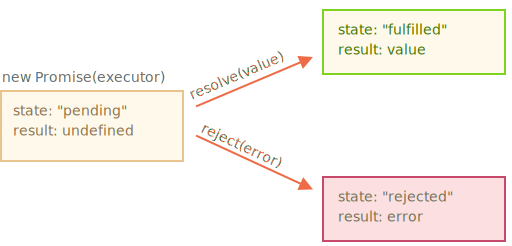

# JavaScript : A tour of the JavaScript Engine🚀⚙️

###
As JavaScript devs, we usually don't have any idea how our JavaScript codes deal with compilers and how can machine actually understand the code that we've written !!?

However,in this blog we'll discuss about basics of the JavaScript Engine and see how it handles our human-friendly JavaScript code and turns it into machine code.


## Journey of Early JS Engine
The first JavaScript engine, codenamed SpiderMonkey, was built for Netscape Navigator and was simply an interpreter that read and executed source code. At the time, and for many years after, Javascript generally consisted of a few functions written into the head of a webpage or a handful of inline events. Interpreting the code as needed was satisfactory, if not fast.

We’ll skip the next 10 tumultuous years, to 2004, when Google introduced a new application; Google Maps. For Javascript and developers everywhere it was a game changer. A very, very slow game changer. Browsers bogged down as the JavaScript engine simply plowed away at all that code.  


```Douglas Crockford, author of JavaScript: The Good Parts, said “JavaScript contains some of the best ideas ever put into a programming language and it contains some of the worst ideas ever put into a programming language.” It was created in just 10 days in 1995, and not standardized by ECMA until almost 3 years later.```