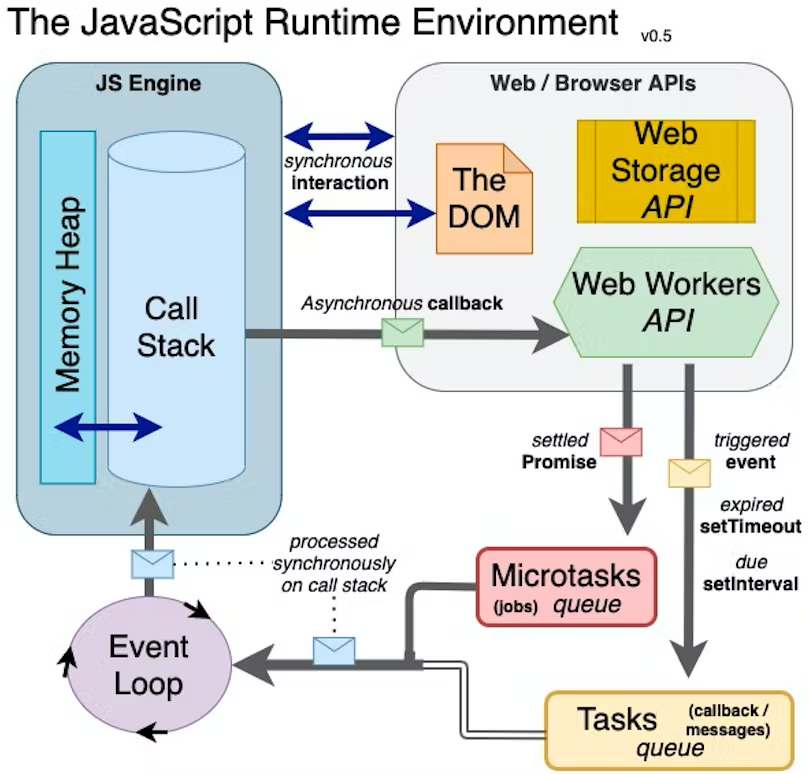

# <ins>JavaScript Runtime Environment</ins>
JavaScript Runtime Environment is like a container that has all the things to run a JavaScript Code.Every Browser has it's own JS Runtime Environment. Which is consists of -
~~~
          - [x] The JS Engine :rocket:
          - [] Web/Browser APIs :earth_asia:
          - [] Callback Queues :watch:
          - [] Microtask Queues :hourglass_flowing_sand:
          - [] Event Loop :loop:
~~~

